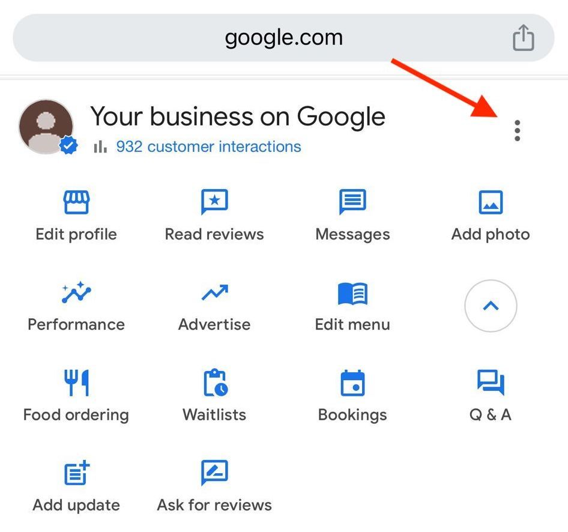

# How to add Cloudwaitress to your Google Business Profile

**Time estimate:** 5 minutes

**Prerequisites:** You must be the owner of the Google Business Profile to grant access to other users.

***

### Getting Started

1. Navigate to [business.google.com](http://business.google.com/) and sign in with your Google account
2. Select your business location if you have multiple listings

***

### Granting Access to CloudWaitress

#### Step 1: Access Google Account Settings

<figure><figcaption></figcaption></figure>

#### Step 2: Click Business Profile Settings

<figure><figcaption></figcaption></figure>

#### Step 3: Navigate to People and Access

* Look for the "People and Access" option in the left sidebar or settings menu
* Click on "People and Access" to open the user management section

<figure><figcaption></figcaption></figure>

#### Step 4: Add CloudWaitress as a Manager

* Click the "Add people" or "Invite" button
* Enter the email: [cloudwaitressonline@gmail.com](mailto:cloudwaitressonline@gmail.com)
* Select **"Manager"** from the permission level dropdown
* Click "Invite" or "Send invitation"

<figure><figcaption></figcaption></figure>

#### Step 5: Verify the Access

You should see [cloudwaitressonline@gmail.com](mailto:cloudwaitressonline@gmail.com) listed as a "Manager" in your People and Access list with a "Pending" or "Active" status.

<figure><figcaption></figcaption></figure>

***

#### Why This Matters

By granting Manager permissions, you maintain full ownership and control of your Google Business Profile. CloudWaitress can access your profile to:

* Optimize your listing for better visibility
* Run promotions and special offers
* Update business information
* Respond to reviews
* Add posts and updates
* Improve your profile for better sales performance

**Important:** You retain owner access and can revoke CloudWaitress permissions at any time.

***

### Troubleshooting

**Don't see "People and Access"?**

* Make sure you're logged in as the business owner
* Try refreshing the page
* Ensure you've selected the correct business location

**Email address not accepted?**

* Double-check the email: [cloudwaitressonline@gmail.com](mailto:cloudwaitressonline@gmail.com)
* Make sure there are no extra spaces
* Try using the "Add by email" option instead of searching

**Only see "Owner" as an option?**

* You may need to confirm your business ownership first
* Contact Google Business support to verify your account status

**Invitation not going through?**

* Check your internet connection
* Try a different browser (Chrome recommended)
* Clear your browser cache and try again

***

### What Happens Next?

1. CloudWaitress will receive an email invitation to access your profile
2. Once accepted, you'll see the status change from "Pending" to "Active"
3. CloudWaitress will reach out to confirm access and discuss optimization plans
4. You can monitor all changes CloudWaitress makes through your owner dashboard

***

### Need Help?

If you encounter any issues completing these steps, contact the CloudWaitress support team at [support@cloudwaitress.com](mailto:support@cloudwaitress.com) or reach out to your account manager.

